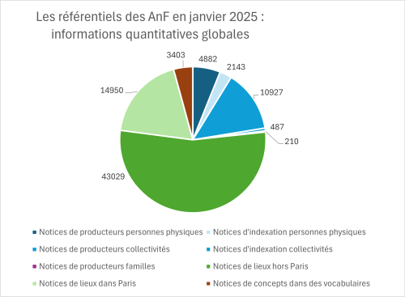
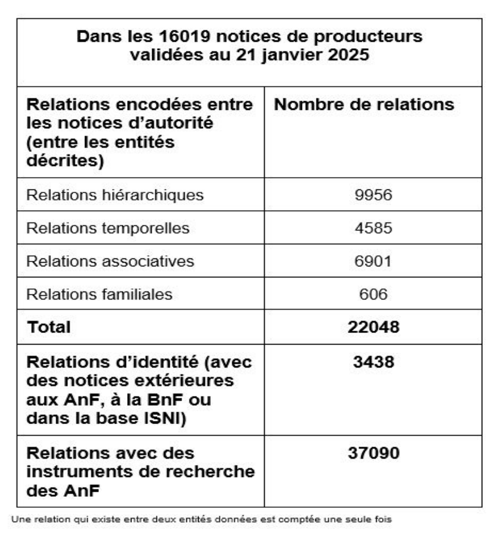
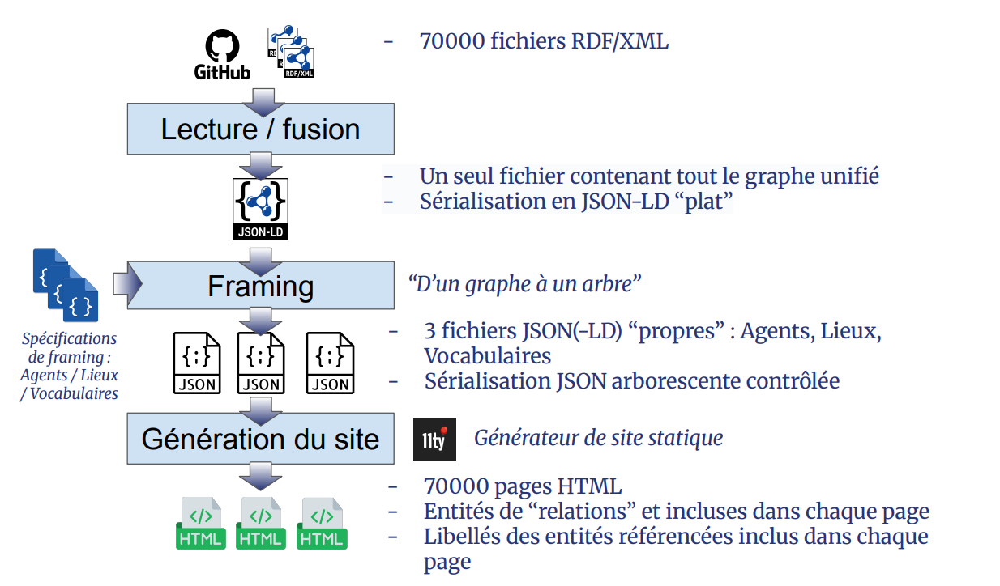

# Le projet

*Note : le contenu de cette page sera modifié dans les prochaines semaines.*

## Enjeux et objectifs

Les objectifs du projet sont les suivants :

- Rendre accessibles aux humains comme aux machines des données de référence produites au fil de décennies d’efforts et valoriser l’expertise des AnF sur les entités décrites (par exemple en histoire des administrations centrales du Moyen Âge à nos jours) ;
- Révéler le graphe sous-jacent en sémantisant les données, afin d’obtenir, à partir d’une collection de fichiers XML conformes à plusieurs modèles différents, un graphe de connaissances unifié reliant entre elles les entités décrites.

> Le graphique ci-contre donne une idée de la répartition des descriptions dans la collection initiale de fichiers, par type de notice puis par type d’entité.
> 

> Le tableau ci-dessous présente des statistiques sur le nombre de relations existant entre les notices de producteurs dans les fichiers source, relations actuellement non interrogeables via la Salle des lectures virtuelles (SLV) des AnF.
> 

- Rendre ce graphe conforme à des standards internationaux adaptés à la nature des données (essentiellement [RiC-O 1.1](https://www.ica.org/standards/RiC/ontology) et [SKOS](https://www.w3.org/2004/02/skos/)) et permettant d’envisager ensuite de faire évoluer sans difficulté ces données, et de les lier avec d’autres jeux de données (ou l’inverse) ;
- Améliorer la qualité des données en corrigeant certains défauts, en optimisant et en enrichissant l’existant, et en ajoutant de nouvelles entités ;
- Proposer une interface de consultation intuitive, réactive et efficace, adaptée à la nature des données (un graphe de connaissances) et à leur contenu, avec de multiples dispositifs d’accès et des dispositifs de recherche performants, pour les utilisateurs humains et les machines ; ceci en privilégiant une architecture simple, le plus sobre possible, la simplicité du déploiement et des outils open source et des standards techniques ;
- Explorer au fil de l’ensemble des travaux menés des pistes pour l’avenir du système d’information des AnF, qu’il s’agisse des données de référence elles-mêmes ou des fonctionnalités de ce SI.

## Réalisation de Garance

### Production du contenu

Nous donnons ci-après quelques informations sur le processus suivi pour la production de la version 2.0 des référentiels sémantisés. Le travail a été réalisé par le Lab en plusieurs phases et itérations, à partir des données source exportées du SIA des AnF en janvier 2025, en suivant des processus automatiques bien souvent associés à des travaux de correction manuels.

---

### URIs des entités

Les URIs des entités (agents, concepts et lieux) sont formés comme suit, conformément à une approche choisie depuis plusieurs années :
- Un segment invariant : `https://rdf.archives-nationales.culture.gouv.fr/`
- Suivi du nom sans majuscule de la classe RiC-O de référence et d’un slash (par exemple `agent/` ou `place/`)
- Suivi d’une chaîne de caractères construite à partir de l’identifiant unique local de l’entité dans le SIA, ou, dans les rares cas où l’entité a été ajoutée, d’un identifiant forgé à partir du nom privilégié en français de l’entité.

---

### Production des vocabulaires contrôlés

Sauf exception (cas du vocabulaire dit des types de documents scindé en trois fichiers RDF), un fichier RDF/XML a été généré par vocabulaire source du SIA. La structure de ce fichier est conforme au modèle [SKOS](https://www.w3.org/2004/02/skos/) (donc à ISO 25964). En outre, chacun des concepts (`skos:Concept`) définis dans ces vocabulaires est également défini comme étant une instance d’une classe de l’ontologie RiC-O 1.1.

Les données stockées initialement dans quelques éléments XML d’une DTD propre aux AnF ont été restructurées pour distinguer libellés, définition, note d’application, relations sémantiques, alignements, informations de gestion. Dans quelques cas (notamment pour le vocabulaire des types de collectivités), des contenus également produits par les AnF et stockés à l’externe ont été agrégés aux vocabulaires.

Des métadonnées précises ont été ajoutées à chaque vocabulaire (`skos:ConceptScheme`). Quelques nouveaux concepts ont été ajoutés à ceux qui existaient déjà. Un nouveau vocabulaire contrôlé, celui des types de lieux, qui était indispensable pour catégoriser l’ensemble des lieux décrits, a par ailleurs été entièrement produit en RDF (il n’a pas d’équivalent actuel dans le SIA). Tous les concepts ainsi ajoutés à ceux existant dans le SIA sont qualifiés de candidats. Des exemples ont été ajoutés dans certains vocabulaires.

Enfin, pour faciliter certaines réutilisations, à partir de chacun des fichiers SKOS produits, un fichier CSV, contenant l’intégralité de ce qui est stocké dans le vocabulaire, a été généré et est téléchargeable depuis GitHub ou depuis les pages de vocabulaires de Garance.

---

### Production des notices d’agents

Les quelque 16 000 notices de producteurs des AnF ont été converties en autant de fichiers RDF/XML conformes à RiC-O 1.1, à l’aide de la [version 3 du logiciel RiC-O Converter](https://github.com/ArchivesNationalesFR/rico-converter/releases/tag/3.0.0) et conformément à ses spécifications. Quelques post-traitements ont ensuite été réalisés.

Chacune des petites notices contenues dans les deux référentiels dits d’indexation des personnes physiques et des personnes morales (un fichier par référentiel) a été convertie en un fichier RDF/XML conforme à la même ontologie et ayant la même structure, en tirant le meilleur parti des conventions suivies aux AnF pour la saisie des données (distinction des informations historiques, des dates d’existence, des relations d’équivalence, des mentions de sources, des métadonnées de gestion).

Les notices obtenues ont ensuite été réconciliées puis dédoublonnées. En tout, le contenu de 255 fichiers RDF issus d’autant de notices d’indexation a été fusionné avec les notices de producteurs, puis ces fichiers RDF supprimés. Le numéro de la notice du référentiel d’indexation est conservé dans le fichier RDF résultat. Enfin, les fichiers RDF ont été enrichis de plus de 4 000 relations d’équivalence avec des entités Wikidata et de plus de 1 200 liens vers des pages Wikipédia, en partant du travail effectué par les archivistes des AnF dans le cadre d’un atelier organisé en décembre 2025.

---

### Production des notices de lieux

Un fichier XML/RDF a été produit à partir de chacune des notices contenues dans les 8 fichiers XML source (sauf pour les notices des arrondissements et cantons français, laissées de côté dans l’immédiat).

En ce qui concerne les régions, départements et communes français, un travail d’alignement a été réalisé en 2021, d’une part avec les données RDF de l’INSEE (ce qui a permis de récupérer en particulier des informations historiques), d’autre part avec les données RDF de l’IGN – fournies à l’époque par Nathalie Abadie du LASTIG, que nous remercions. Ce dernier alignement a permis de récupérer en particulier les coordonnées géographiques (polygones) des lieux et les relations d’adjacence entre territoires. Les relations partitives (comme la localisation d’une commune dans un département) ont pu être rendues explicites.

Pour tous les autres lieux sauf ceux situés dans Paris (pays et territoires étrangers, lieux géographiques naturels, aménagements et édifices, lieux-dits), et pour les 1 492 édifices situés à Paris, le contenu des petites notices source a été traité pour identifier et restructurer les informations de datation, de description, ainsi que, lorsqu’elles étaient présentes, les relations d’alignement avec des référentiels externes (surtout Geonames et Wikidata), les sources d’information et les métadonnées de gestion.

Pour les arrondissements, quartiers et paroisses de Paris et les communes rattachées à Paris au XIXe siècle, la nomenclature initiale a été enrichie manuellement sur la base de sources d’information généralistes (Wikipédia) essentiellement. Les relations entre quartiers et arrondissements ont aussi été ajoutées, ainsi que les relations spécifiant l’absorption partielle ou totale du territoire d’une commune à un arrondissement ou quartier parisien.

Pour les voies de Paris, le projet a permis de passer, en plusieurs étapes et itérations incluant des travaux de réconciliation et de modélisation, d’une simple nomenclature de 13 189 noms à une description souvent plus précise de chaque rue. Les noms du référentiel des AnF ont été alignés avec les noms de la nomenclature des voies caduques et actuelles de Paris publiée en open data par la mairie de Paris (version de 2023). Puis les données de cette nomenclature ont été ramenées dans le jeu de données des AnF sous la forme d’informations restructurées conformément à RiC-O : historique, événements de gestion de la voirie ayant affecté la rue, dimensions, coordonnées géographiques (notamment polygones), indications des quartiers et arrondissements traversés et des points de départ et d’arrivée de la rue. Le type de voie a été ajouté en utilisant le vocabulaire des types de lieux.

Pour tous les lieux, les dénominations préférentielles ont été mises en conformité, autant que possible, avec les règles énoncées par le [code RDA-FR](https://code.rdafr.fr/entite/lieu/), transposition française du standard RDA (Ressources : Description et Accès) pour le signalement des ressources des bibliothèques. Enfin, tous les lieux ont été catégorisés à l’aide d’un type de lieu trouvé dans le référentiel des types de lieux des AnF.

---

### Finalisation et publication

La version 2.0 du graphe obtenu est en cours de finalisation. L’ensemble des fichiers est disponible sur [GitHub](https://github.com/ArchivesNationalesFR/Referentiels). Une release complète et cohérente sera publiée sur GitHub avant la mi-juin 2026, et son contenu sera bien évidemment en même temps rendu accessible via Garance.

Par ailleurs, pour les besoins du projet (en particulier pour la description des agents et des voies de Paris) et d’autres projets, une petite extension de l’ontologie RiC-O 1.1 a été élaborée ([voir ici](https://github.com/ArchivesNationalesFR/ontology)), dont la version 1.0 sera publiée en juin 2026.

## Conception et réalisation de l’application Garance et de son interface web

La réalisation de l’application Garance a été confiée à la société Sparna, avec laquelle les AnF collaborent sur divers projets depuis plusieurs années et que nous remercions ici. Une approche agile est suivie pour l’ensemble des travaux. La version de Garance actuellement disponible sur le web est la version 1.
Le triplestore QLever a été déployé et est maintenu par la société Zazuko GmbH, que nous remercions également.

---

### Architecture technique

L’architecture technique actuelle de Garance inclut :
- des scripts qui, à partir des quelque 70 000 fichiers RDF que compte le dépôt GitHub des référentiels sémantisés, produisent des fichiers JSON conformes à trois spécifications de framing écrites dans le langage [JSON-LD framing](https://www.w3.org/TR/json-ld11-framing/) ;
- un générateur de site web statique, [Eleventy](https://www.11ty.dev/), qui produit, à partir des fichiers JSON, autant de pages statiques qu’il y a de vocabulaires, de notices de lieux et de notices d’agents, et produit aussi les pages statiques éditoriales du site web, à partir de fichiers Markdown faciles à éditer ;
- un index du contenu des pages HTML, configuré et produit avec le logiciel [PageFind](https://pagefind.app/) ;
- un triplestore, en l’occurrence une instance du logiciel open source [QLever](https://github.com/ad-freiburg/qlever), récemment développé en Suisse et dont le Lab a pu vérifier les qualités en le testant sur ses jeux de données RDF. En particulier, nous avons pu vérifier la rapidité de QLever dans l’exécution des imports et de l’indexation, ainsi que dans l’exécution des requêtes SPARQL.

Le code source de Garance est disponible [ici](https://github.com/sparna-git/garance).

Le site web et l’index des pages HTML sont régulièrement régénérés à partir du dépôt GitHub et copiés sur le serveur de l’hébergeur retenu, sur le cloud du ministère de la Culture.

---

### Fonctionnalités

La version 1 de Garance propose actuellement, via une interface disponible en français et en anglais, diverses fonctionnalités accessibles par le menu horizontal présent sur toutes les pages :

- Par l’item **Référentiels**, un accès direct aux données :
  - via l’item **Vocabulaires contrôlés**, un accès à chacun des 13 vocabulaires contrôlés ;
  - via l’item **Agents** ou **Lieux** :
    - quand on clique directement sur l’item, accès à une page de présentation générale des notices, incluant quelques diagrammes et une liste d’exemples ;
    - quand on choisit le sous-item **« Index alphabétique »**, accès à une liste alphabétique complète des agents ou des lieux, triés selon les noms privilégiés des entités ;

- Par l’item **Recherche**, une page permettant d’effectuer une recherche rapide dans le contenu des pages à l’aide d’un index construit avec PageFind, configuré pour s’adapter à la structure et à la nature des données disponibles. Les résultats de recherche montrent le mot ou l’expression saisie en contexte. Une fois une première recherche effectuée, la colonne de gauche permet d’afficher et de choisir ou décocher divers filtres (comme le type de lieu ou le type de collectivité), pour réduire le périmètre de la recherche.

- Par l’item **Accès SPARQL**, une page qui donne notamment les liens utiles aux utilisateurs désirant soit interroger à distance le service SPARQL via une application tierce, soit interroger directement le endpoint SPARQL via une interface de saisie de requêtes dans ce langage.

Chaque page d’entité présente une structure définie par un fichier de spécifications propre au type d’entité (agent, lieu ou concept). Un soin tout particulier a été apporté à la conception et à l’organisation de ces pages. Les vocabulaires s’affichent sous la forme d’un diagramme dépliable. Il est par ailleurs possible de copier/coller l’URI d’une entité, de télécharger le fichier RDF décrivant l’agent, le lieu ou le vocabulaire contrôlé, ainsi que les fichiers CSV (pour les vocabulaires contrôlés) ou XML/EAC-CPF (pour les notices d’agents issues des notices de producteurs des AnF).

Pour toute question ou commentaire sur ces fonctionnalités, n’hésitez pas à nous contacter (voir la page [Contact](contact)).

---

### Feuille de route du projet pour 2026

Vous trouverez ci-après quelques informations non exhaustives sur la feuille de route du projet Garance.

**Avant la mi-juin 2026**

- Publication de la release de la version 2 des référentiels, incluant notamment, outre ce qui est déjà disponible, des versions fortement enrichies des référentiels des types de documents et de groupes de documents, et, sans doute, l’ajout dans chaque fichier RDF d’une propriété spécifiant un score de qualité calculé à partir du contenu du fichier.
- Intégration à l’interface d’une documentation technique sur le profil des données contenues dans Garance (profils SHACL).

**Avant la fin 2026**

- Mise à jour des contenus de Garance à partir d’une version récente des fichiers source, qui sont continuellement enrichis par les archivistes des AnF (en particulier pour ce qui concerne le référentiel des producteurs).
- Dans la limite du temps disponible, travaux de mise à jour des données sur les circonscriptions administratives françaises et d’alignement de lieux avec des jeux de données externes (afin notamment d’enrichir les fichiers RDF d’informations historiques, de relations temporelles et de coordonnées géographiques).
- Dans la limite du temps disponible, mise en conformité des noms privilégiés des agents avec la norme RDA-FR.
- Intégration à l’interface de Garance d’une fonctionnalité de recherche avancée, permettant à tout utilisateur intéressé de construire des requêtes SPARQL en explorant le graphe, sans connaître le modèle de données utilisé ni le langage SPARQL, à l’aide de la dernière version en date de l’outil [Sparnatural](https://sparnatural.eu/).